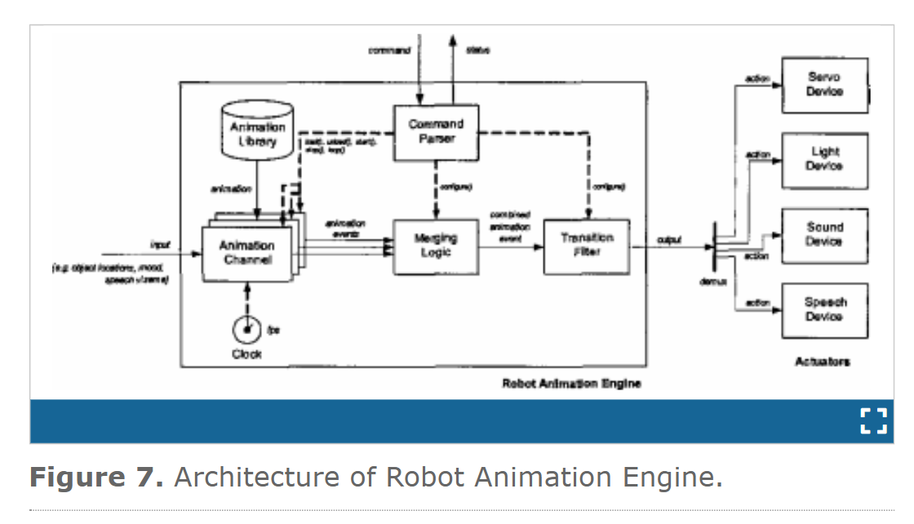
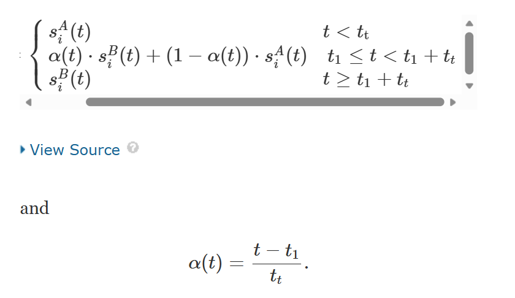
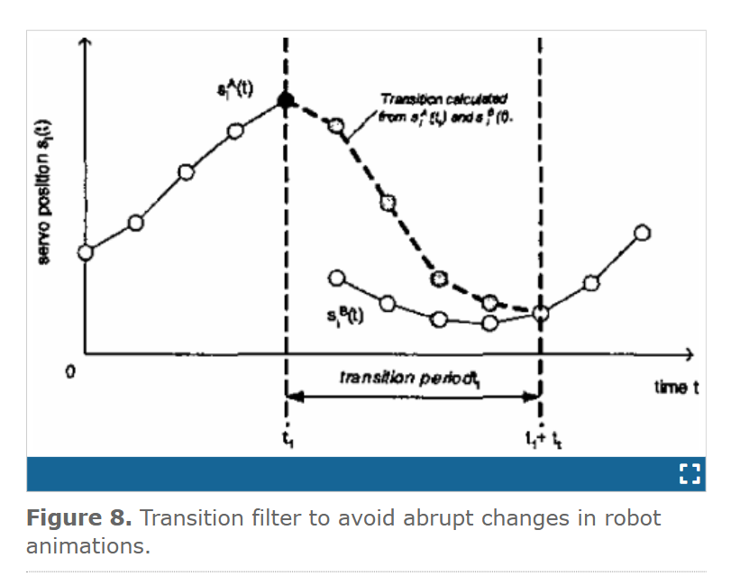

# Animation Engine for Believable Interactive User-Interface Robots
like: https://ieeexplore.ieee.org/document/1389845

## Robot Animation Engine
We use an abstract robot animation interface to integrate different computational robot animation models. This interface defines three elementary aspects of a robot animation. 
1. Every robot animation has a unique name attribute
2. A robot animation has an initialize method that is called each time the robot animation is (re-)started
3. a robot animation has a method to provide the next animation event

Every computational robot animation model is derived from the abstract robot animation interface. Each may have additional attributes and methods relevant for that computational model.

- Animation Library - Preloads and stores all robot animations
- Command Parser - Interprets commands received from a higher-level deliberation layer
- Animation Channel - Controls the execution of a single robot animation
- Merging Logic - Combines multiple animation events into a single event
- Transition Filler - Realizes a bumpless sequence of animation events
- Clock - Determines execution framerate of Animation Channels

### Animation Channels
Animation channels can, at runtime, be loaded and unloaded with robot animations from the Animation Library. Different channel parameters can be set to control the execution of the loaded robot animation. An animation channel could loop the animation, start with a delay, start at a particular frame, or synchronize on another animation channel. Once the robot animation has been loaded and all parameters are set, the animation can be started stopped, paused or resumed.

### Merging Logic
- Priority - Actuator actions with a lower priority are overruled by those with a higher priority
- (weighted) Addition - Actuator actions are multiplied by a weighting factor and added
- Min / Max - The actuator action with min / max value is selected
- Multiplication - All actuator actions are multiplied

  
   

### Transition Filter

  
   
  <em>Figure 1: Transition Filter</em>

  
   
  <em>Figure 2: Transition Filter Curve</em>

