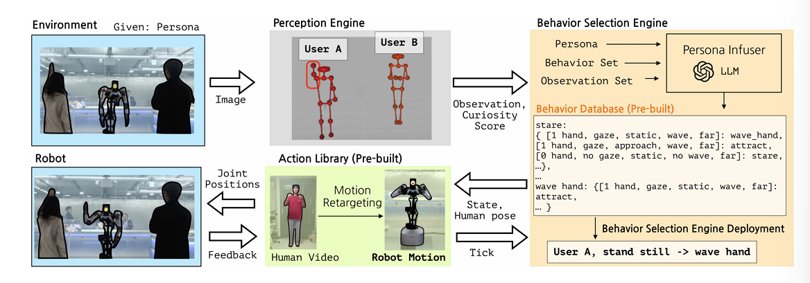
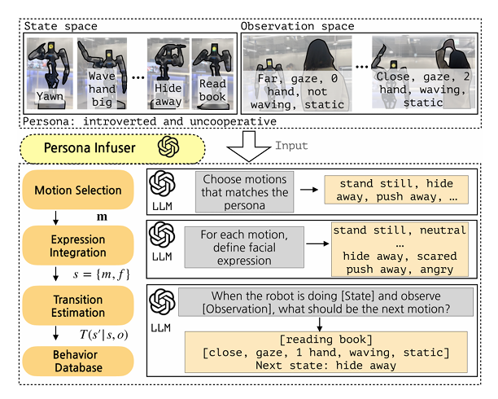

# Towards Embedding Dynamic Personas in Interactive Robots: Masquerading Animated Social Kinematic (MASK)
link: https://ieeexplore.ieee.org/ielx8/7083369/10638067/10643257.pdf?tp=&arnumber=10643257&isnumber=10638067&ref=aHR0cHM6Ly9zY2hvbGFyLmdvb2dsZS5jb20v

## Introduction
Hypothesis: Embedding a character template into robotic behavior, interactive agents can convincingly embody distinct personas for users to engage with. FSM framework to determine robotic action from user behavior. Focus on non-verbal.
1. Perception engine - extracts meaningful features from 3D body pose
2. Behavior selection engine - selects appropriate robotic behavior within the context 
3. Action library - collection of robot motions and facial expressions

## Proposed Method
Perception engine estimates the 3D body poses of users. Human pose information to obtian a curiousity score. This data is used by the behavior selection engine - fsm - defines the robot's persona-infused behavior. In the behavior selection engine, the robot selects the subsequent motion and corresponding facial axpression based on the observation and current state. The engine's behavior database maps observations and robot's persona to specific state-action transitions. The behavior database is pre-built and populated by a persona-infuser, leveraging LLMs to construct transitions autonomously. 

  
   
  <em>Figure 1: Architecture.</em>

### Non-Verbal Cues
Users interacting with the robot through body poses. Human non-verbal cues are defined as elements; numbers of raised hands, distance between human and robot, is human looking at the robot, and hand velocity. These elements form the observation space, encompassing all possible combinations of each observation element. Robots' reactions utilize a discrete set of generated motions and facial expressions.

### Automated Persona Infuser Via LLM
The database acts as a blueprint for persona-driven behavior, encoding all possible combinations of states, observations, and transitions by LLMs. The db is pre-built to reduce latency from LM inference. gpt 4. The input of the LLM is the state space, the observation space, and persona. The LLM estimates state transitions. The behavior db is formulated as a dictionary. 

  
   
  <em>Figure 2: Persona Infuser.</em>

**1. Motion Selection**
Utilize LLMs to predict the set of motions relevant to a given persona - helps filter out states unrelated. The input of the LLM: robot's motion cues, target persona, and motion selection prompt. 

**2. Expression Integration**
Establish state s that pairs each selected motion with corresponding facial expression, conditioned on motion. 
Utilize LLMs to define initial state.

**3. Transition Estimation**
Based on the persona-based state sets s, estimate the state transitions via LLMs. To infer robot's next state - repeate the eval process for each combo of current states and observations, resulting in numerous iterations. Formulate the deterministic state transition, where LLMs directly estimate the next state given the current and observation. The input of LLM is a state set s from the previous, the target persona, current observation, current state, and the state transition. 

### Perception Engine
During the real-time deployment phase, the perception engine detects the user's body pose to determine the user's state. The input is an RGBD image, and the output is the observation and a curiousity score - how "interesting".
Transform body skeleton data into five observation categories: the number of hands raised above nose level, eye gaze, distance, hand movement speed, and approaching velocity. The gaze function is defined as the cosine of the angle between the normal vector to the plane formed by the nose and both eyes and the position vector of the nose (measure of the direction in which the nose is pointing relative to the plane of the eyes).
Curiousity score determines which user to interact with in multi-person scenarios

### Behavior Selection Engine
Selects the next state situated within the context. Based on observations, the robot's current state, and the behavior database, the selection engine selects the next state and the user to interact with. Curiousity decrease rate to be dynamic, the rate slows for users expressing strong interest - allowing extended interaction. Decisions for state change unfold at two key points
1. when changes occur in observation
2. when a person of interest changes

### Action Library
