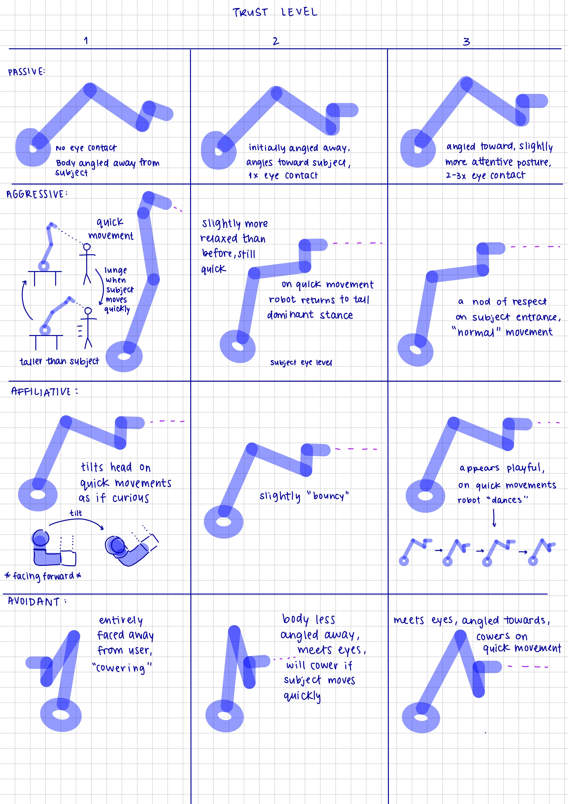
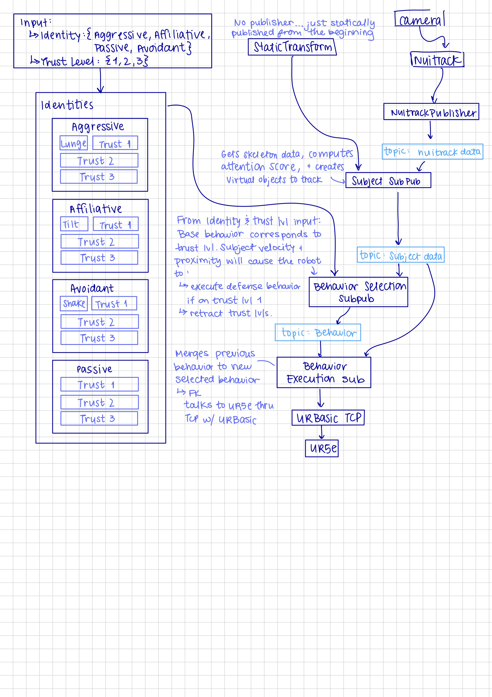

## Referenced Articles

- Social strategies associated with identity profiles in dairy goats: https://www.sciencedirect.com/science/article/pii/S0168159111001936?via%3Dihub
- https://pmc.ncbi.nlm.nih.gov/articles/PMC7680732

## The Guiding Questions:
- How does trust in a robot evolve over time?
- Does a certain identity profile elicit more trust? 
- Does robot trust affect human trust?
- Does building trust affect perception of the robot? Does the user still view the UR5e as strictly a robot arm - or is there emotional involvement now?
- HAR (human-animal relationship) -> HRR (Human-robot relationship)

## Identity Types in Animals

### What are the types?

| Trait | Affiliative | Passive | Aggressive | Avoidant |
|-----------|----------|----------|-----------|-------|
| Positive social interactions | High | Low | Low | Low |
| Social Bonding | Actively forms/maintains | Little involvement | Weak; interactions often conflict-based | Weak; tends to withdraw |
| Response to social encounters | Friendly, cooperative | Neutral/indifferent | Competitive, confrontational | Withdraws or keeps distance |
| Typical description | Seeks/maintains positive social relationships | Neither seeks social nor actively avoids others - remains uninvolved in social interactions | Frequently initiates fights, challenges others | Actively keeps away from other animals, withdraws from interactions, move away from conflicts |

### How do these types trust?

**Affiliative**
- Voluntary approaches
- Seeks proximity, even with no food
- Accepts touch readily
- May follow the person
- Shows relaxed body posture around them

**Passive**
- Doesn't seek you out
- Not much excitement
- Just calm and unconcerned

**Aggressive**
- Becomes cooperative
- Tolerate handling from the person while remaining difficult with strangers

**Avoidant**
- Doesn't retreat
- May remain nearby voluntarily

## High level application to UR5e

### Initial Brainstorm

**Universal behaviour**
- Slight oscillations to mimic breathing

| Type | 1st meeting | 2nd meeting | 3rd meeting |
|------|-------------|-------------|-----------|
| Affiliative | casual posture and movement, holds eye contact, turns head to signal curiousity | casual posture, holds eye contact, slightly "bouyant/bouncy" to signal growing affection | casual posture, holds eye contact, playful movement |
| Passive | casual posture, no eye contact, perhaps pretending to eat something | casual posture, slight eye contact on movement | casual posture, occasionally holds eye contact |
| Aggressive | Erect posture, attentive eye contact, some quick lunging movements towards the person | 90 degree angle posture, sometimes goes up to erect if the user moves too quickly, eye contact | 90 degree angle posture, less aggressive movement, a slight nod on a person entering the frame (to exhibit respect) |
| Avoidant | No eye contact, body is away, heaviest breathing, quivering, lowered head | A bit more curious - some eye contact, body a mix of facing away to leaning towards the person, heavy breathing | Body is towards, keeps some eye contact - mixed between head raised and following person and head down, heavy-ish breathing |

**Notes**
- Could be interesting to include an audible aspect... A unique soundboard for the creature with coos, chirps, growls, etc... Perhaps adjusting sounds from real animals to give a more digitalized tone (if that makes sense)

### Stats

All stats are on a scale of 1-10

**Stat Table**
| Stat | What is 1? | What is 10 | Notes |
|-----------|----------|----------|----------|
| Eye Contact | No eye contact | Eye contact held for the duration |
| Speed | Slow | Fast |
| Breathing | Heavy | None |
| Interest | Angled away from user | Angled Toward user | 

### Identity Profile Stat tables

Trust level of 1 indicates first meeting, trust level of 3 indicates full trust
(this is assuming 3 meetings for each... might be ideal to do more)

**Passive**
| Trust Level | Eye Contact | Speed | Breathing | Interest | Reaction on quick movement | Notes |
|-------------|-------------|-------|-----------|----------|----------------------------|-------|
|      1      |      0      |   3   |     4     |    5     |            None            |       |
|      2      |      1      |   3   |     4     |    7     |            None            |       |
|      3      |      2      |   3   |     4     |    9     |            None            |       |

**Aggressive**
| Trust Level | Eye Contact | Speed | Breathing | Interest | Reaction on quick movement | Notes |
|-------------|-------------|-------|-----------|----------|----------------------------|-------|
|      1      |      10     |   10  |     0     |    10    |            Lunge           | Constantly in a dominant stance |
|      2      |      9      |   8   |     1     |    10    |        Dominant Stance     |       |
|      3      |      8      |   6   |     2     |    10    |            TBD             |       |

**Affiliative**
| Trust Level | Eye Contact | Speed | Breathing | Interest | Reaction on quick movement | Notes |
|-------------|-------------|-------|-----------|----------|----------------------------|-------|
|      1      |      8      |   5   |     4     |    10    |            Head tilt       |       |
|      2      |      9      |   5   |     4     |    10    |        TBD                 |       |
|      3      |      9      |   5   |     5     |    10    |       " Dance "              |       |

**Avoidant**
| Trust Level | Eye Contact | Speed | Breathing | Interest | Reaction on quick movement | Notes |
|-------------|-------------|-------|-----------|----------|----------------------------|-------|
|      1      |      0      |   9   |     9     |    0     | None, already faced away from you  |       |
|      2      |      8      |   8   |     7     |    5     |        Cower                 |       |
|      3      |      8      |   6   |     6     |    8     |        Slight cower           |       |

  
   
  <em>Postures for identity profiles and trust </em>

## Potential Architecture

  
   
  <em>Potential Architecture </em>

### Calculations

Show your mathematical work:

$$
x = \frac{-b \pm \sqrt{b^2 - 4ac}}{2a}
$$

## Challenges & Solutions

### Challenge 1: [Issue Description]

**Problem**: 

**Debugging Steps**:
1.
2.
3.

**Solution**: 

**Lessons Learned**: 

## Next Steps

- [ ] Task 1
- [ ] Task 2
- [ ] Task 3

## References

- [Reference 1](URL)
- [Reference 2](URL)

## Personal Notes

Any additional thoughts, observations, or things to remember...

### Immediate Actions (This Week)

| Action Items | Target Date | Status | Notes |
|-----------|-------------|--------|-------|
| Action Item 1 | YYYY-MM-DD | ✅ Complete | |
| Action Item 2 | YYYY-MM-DD | ⚠️ In Progress | |
| Action Item 3 | YYYY-MM-DD | ⏳ Upcoming | |

---

**Entry completed**: YYYY-MM-DD HH:MM